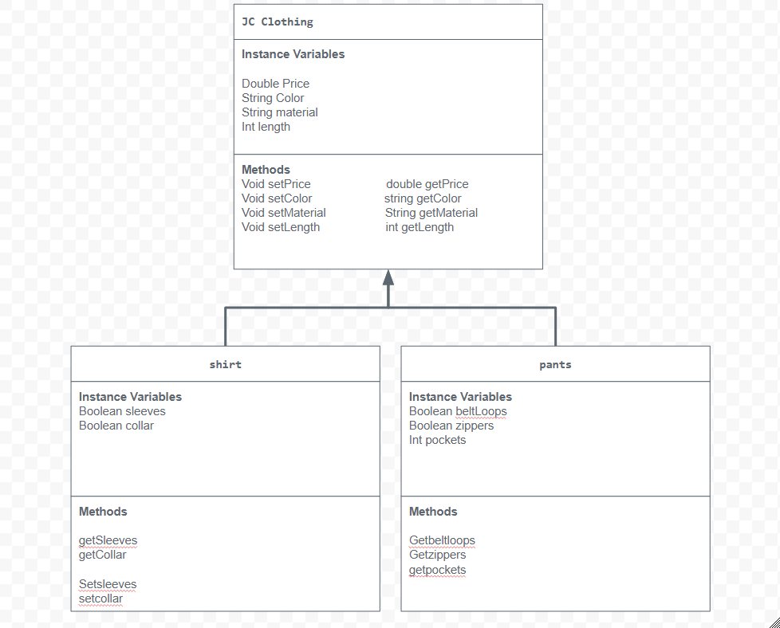

# Unit 2 - Store Management Project

## Introduction

You are opening a new business in your community! Businesses often need programs to manage the products and services they offer and track orders and requests from customers. Your goal is to create a store management system for your business.

## Requirements

Use your knowledge of object-oriented programming and class structure and design to create your store management system:
- **Create a class hierarchy** – Develop a superclass that represents a product or service your business offers and one or more subclasses that extend the superclass to represent more specific types of products or services.
- **Declare instance variables** – Declare instance variables in the superclass that are shared with the subclasses and instance variables in the subclasses that are not shared with the superclass.
- **Write constructors** – Write no-argument and parameterized constructors in the superclass and subclasses. Subclass constructors use the super keyword to call the superclass constructor.
- **Implement accessor and mutator methods** – Write accessor and mutator methods for instance variables that should be accessible and/or modifiable from outside of the class.
- **Implement a toString() method** – Write toString() methods in the superclass and subclasses that return information about the state of an object.

## UML Diagram

Put and image of your UML Diagram here. Upload the image of your UML Diagram to your repository, then use the Markdown syntax to insert your image here.

## Description

In this project, I created a store that represents a clothing brand. I got the inspiration for this idea from seeing many clothing brands on Instagram. I used this inspiration to make a clothing store for this project. My store focuses on different types of clothing, such as shirts and pants, which are represented using classes and inheritance in Java.

The superclass in my project is called clothing, which contains the shared attributes that all clothing items in the store have, such as price, color, material, and length. I created two subclasses from this superclass, which are shirt and pants. These two classes extend clothing to show inheritance. These subclasses include instance variables like hasSleeves, and hasCollar for shirts, and hasBeltLoops, hasZippers, and pockets for pants. All classes have both types of constructors, accessor and mutator methods, and an overridden toString method.

Overall, this project demonstrates Object-Oriented Programming ideas like encapsulation, where the instance variables cannot be accessed from another class, and inheritance where the shirts and pants are a piece of clothing. This project shows how a clothing store organizes different products in a structured and reusable way.
